# AI Center GPU 서버 사용 안내

## 1. 사전 안내사항

### JupyterHub란?


JupyterHub는 브라우저에서 GPU 서버에 접속해 **JupyterLab과 VS Code를 사용할 수 있는 플랫폼**입니다.
"Start My Server"를 클릭하면 GPU/CPU/메모리가 자동으로 할당됩니다. 할당된 자원 범위 안에서만 작업이 실행되므로, 다른 사용자의 작업에 영향을 주지 않습니다.

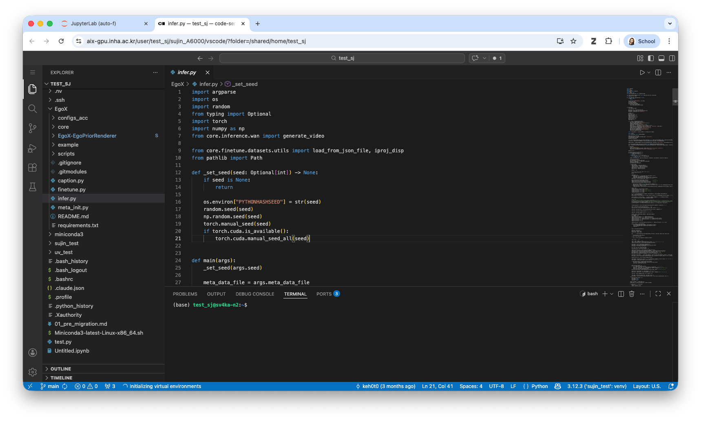
> 로컬 VS Code의 Remote-SSH를 통한 컴퓨트 노드 직접 접속은 **운영 정책상 허용되지 않습니다.**
> VS Code를 사용하려면 JupyterHub에 접속하여 서버를 시작한 후, JupyterLab Launcher에서 **VS Code 아이콘**을 클릭하세요.

### OS 업그레이드 안내

서버 OS를 **Ubuntu 20.04 → 24.04**로 업그레이드하였습니다.
기존 데이터는 `/shared/home/(계정ID)/` 경로 그대로 유지됩니다.

단, **기존 conda 환경은 호환되지 않을 수 있으므로 새로 만드는 것을 권장합니다.**
`conda` 또는 `uv` 중 편한 방식으로 환경을 구성해 주세요.

---

## 2. JupyterHub 접속

**URL:** [https://aix-gpu.inha.ac.kr/](https://aix-gpu.inha.ac.kr/)

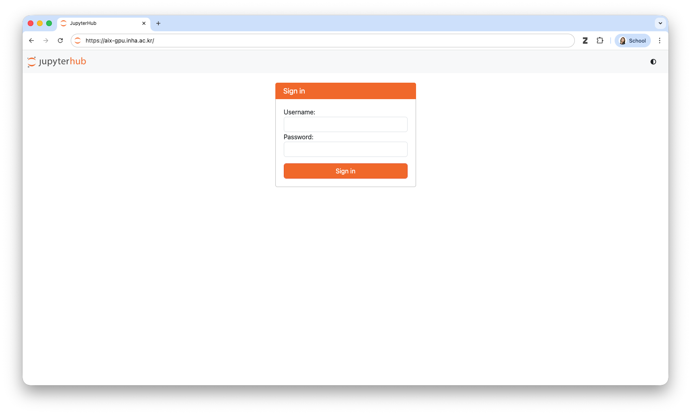

- 위 링크로 접속 후 AI Center 서버 계정(Slurm)으로 로그인
- SSL 인증서 경고가 뜨면 "계속 진행" 클릭 (자체 서명 인증서이므로 정상)

> **(중요)** 자원 할당 신청 전, **Home**으로 이동하여 Named Server를 먼저 생성합니다.

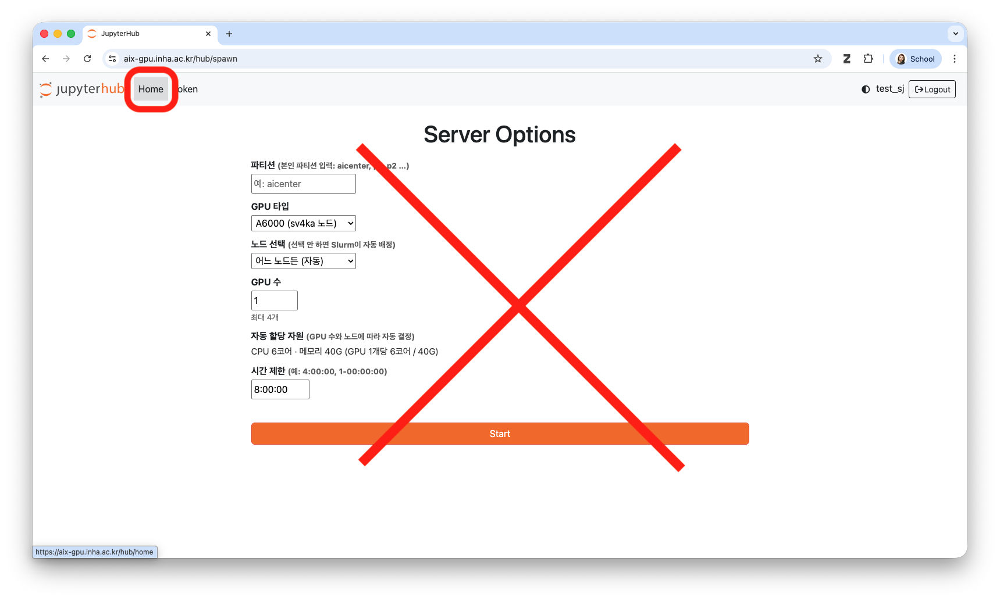

> Named Server는 JupyterHub 내에서 여러 Slurm 잡을 이름으로 구분하여 독립적으로 관리하는 기능으로, 각 Named Server는 별도의 Slurm 잡으로 실행되며 GPU를 각각 할당받습니다.

---

## 3. 서버 생성 절차

### Step 1. Named Server 추가

1. 로그인 후 좌측 상단 **Home** 클릭
2. `Name your server` 입력란에 식별 가능한 이름 입력

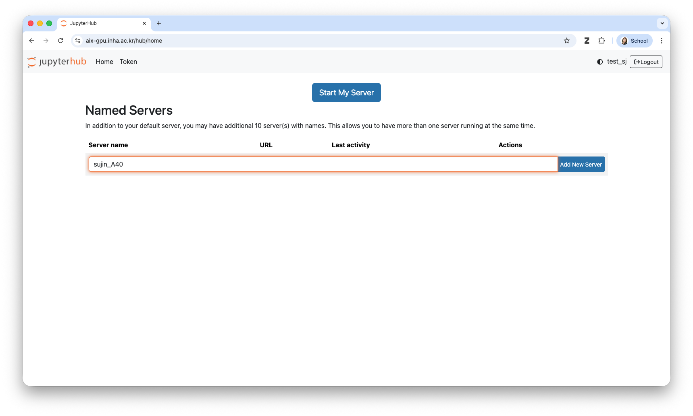

   - 예시: `train_a100`, `dev_a6000`, `sujin_실험1`
3. **Add New Server** 버튼 클릭

### Step 2. 자원 선택

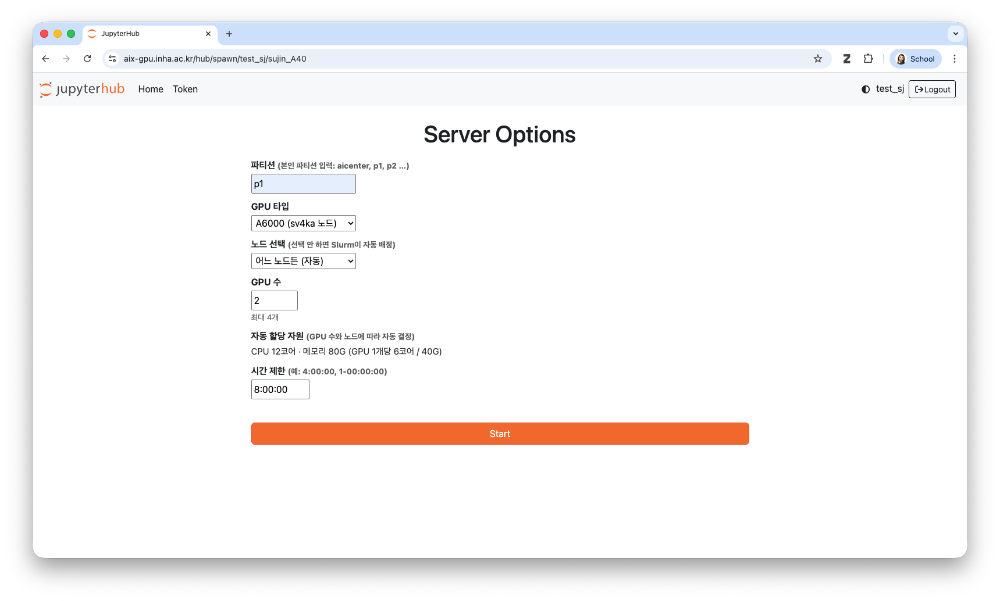
| 항목 | 설명 | 예시 |
|------|------|------|
| 파티션 | 소속 파티션 직접 입력 | `p1`, `p2`, `aicenter` |
| GPU 타입 | 노드 종류 선택 | A6000 / A40 / A100 |
| GPU 수 | 필요한 GPU 개수 | 1 |
| CPU / 메모리 | GPU 수에 따라 자동 계산됨 | — |
| 시간 제한 | 잡 최대 실행 시간 | `8:00:00` |

**GPU 타입별 자원 상한:**

| GPU | 노드 | CPU/GPU | 메모리/GPU | 최대 GPU |
|-----|------|---------|------------|---------|
| A6000 | sv4ka-n[1-4] | 6코어 | 40G | 4 |
| A40 | sv8ka-n[1-3] | 10코어 | 100G | 8 |
| A100 | a100-n[1-4] | 20코어 | 40G | 4 |

### Step 3. 서버 시작

**Start** 클릭 → Slurm 잡 할당 대기 (수 초 ~ 수십 초) → JupyterLab 자동 진입

> 노드에 여유 자원이 없으면 대기(PENDING) 상태가 됩니다.

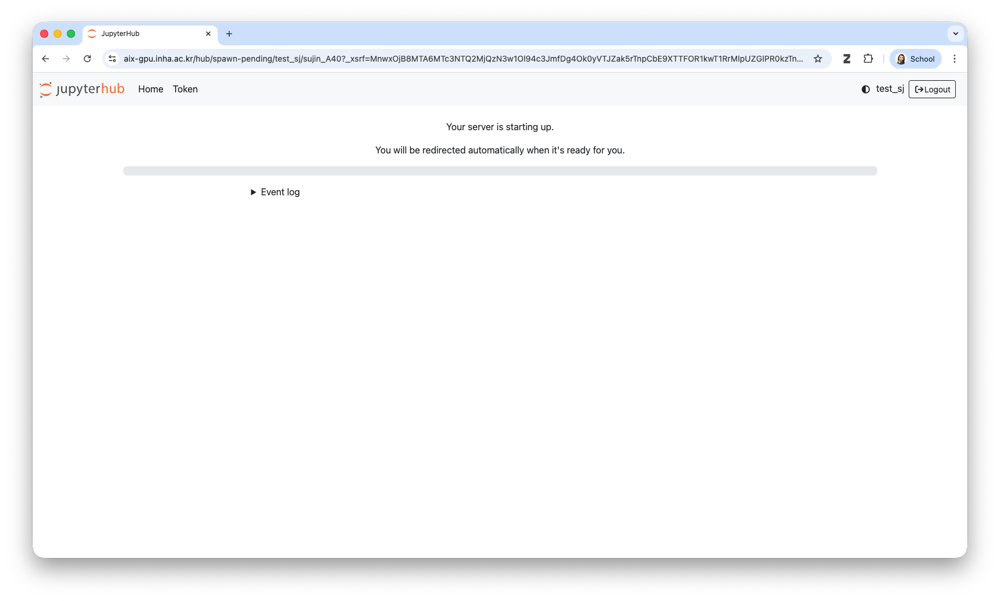

---

## 4. JupyterLab 사용

서버 시작 후 JupyterLab 인터페이스가 브라우저에 열립니다.

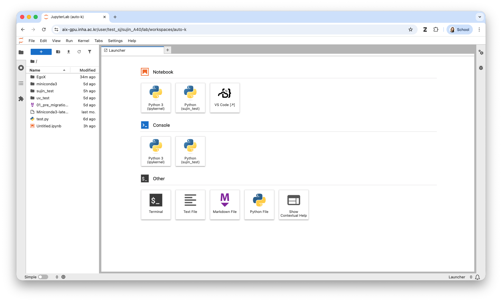


---

## 5. VS Code 사용

1. JupyterLab Launcher 탭에서 **VS Code** 아이콘 클릭

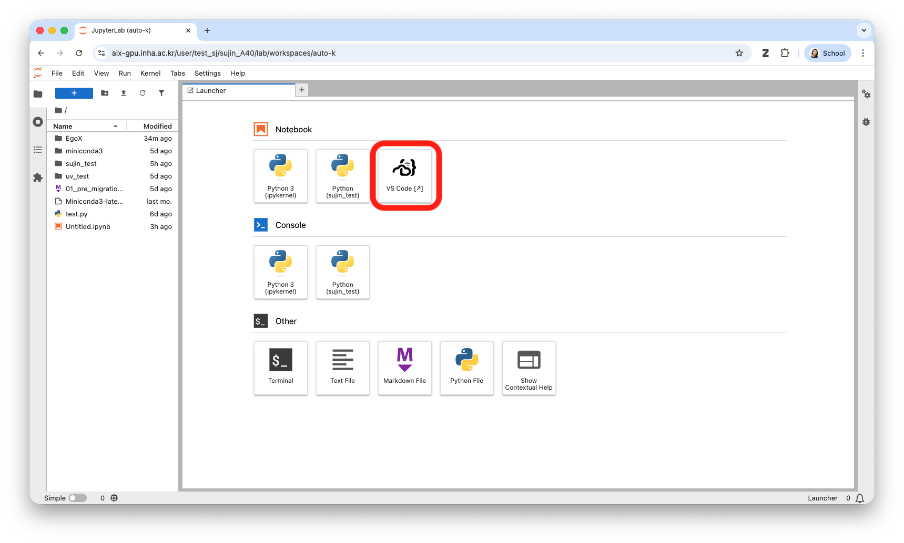
2. 새 탭으로 VS Code 인터페이스 열림

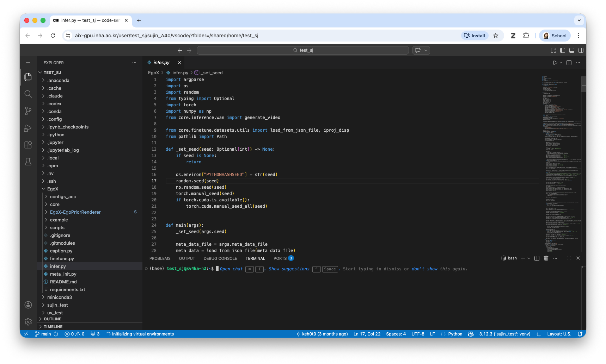


---

## 6. GPU 할당 확인

JupyterLab 또는 VS Code의 터미널에서 확인합니다.

```bash
echo $CUDA_VISIBLE_DEVICES   # 할당된 GPU 인덱스
nvidia-smi                   # 할당받은 GPU만 표시됨
```

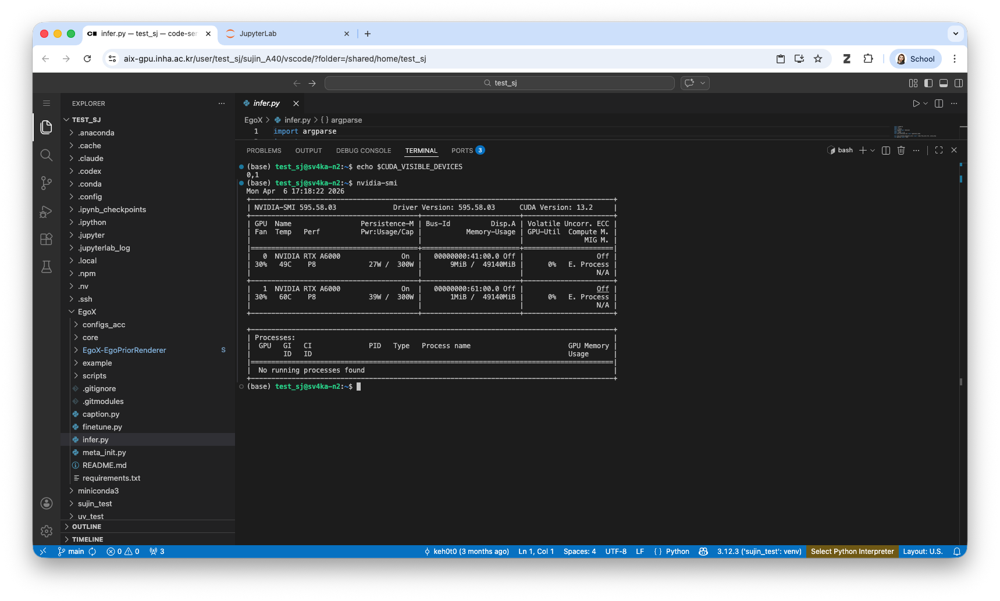

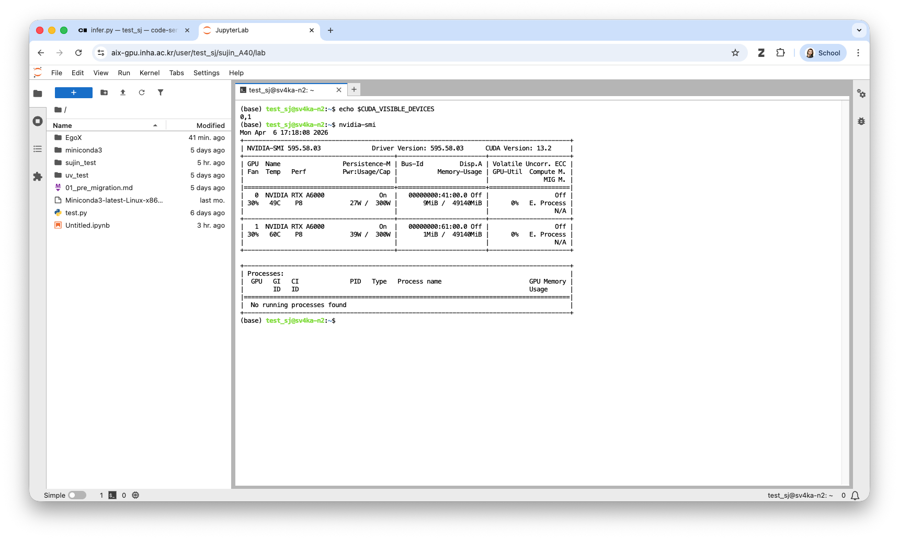


---

## 7. 서버 종료

작업이 끝나면 반드시 서버를 종료하여 다른 사용자가 GPU를 사용할 수 있도록 합니다.

1. 브라우저 상단 **File → Hub Control Panel** 클릭
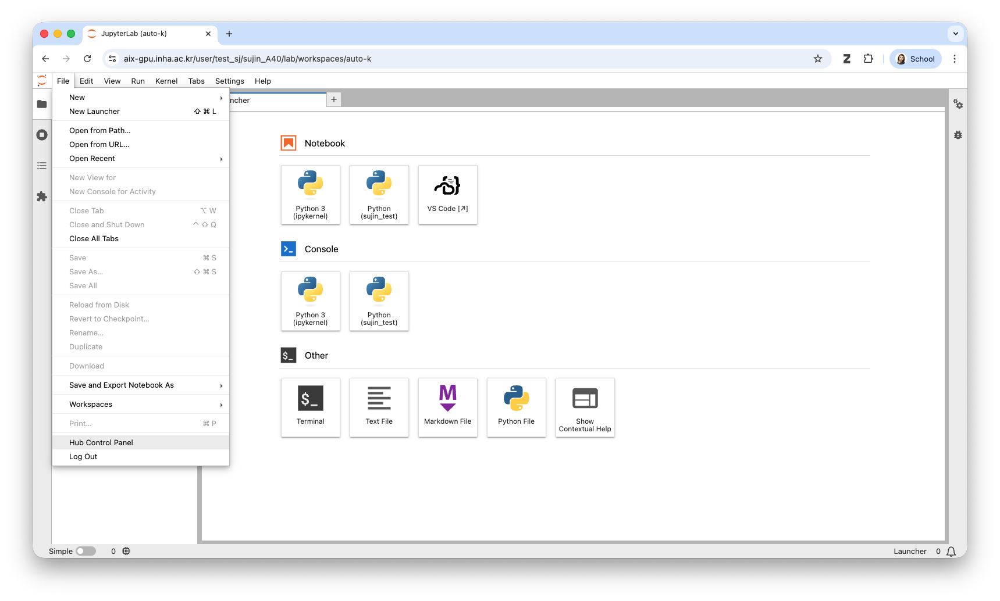

2. 해당 서버의 **Stop** 버튼 클릭
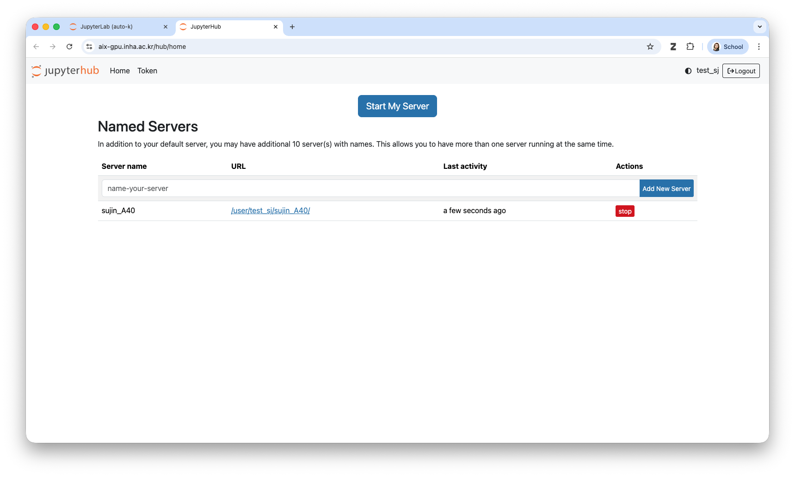

또는 URL에서 직접: `https://aix-gpu.inha.ac.kr/hub/home`
